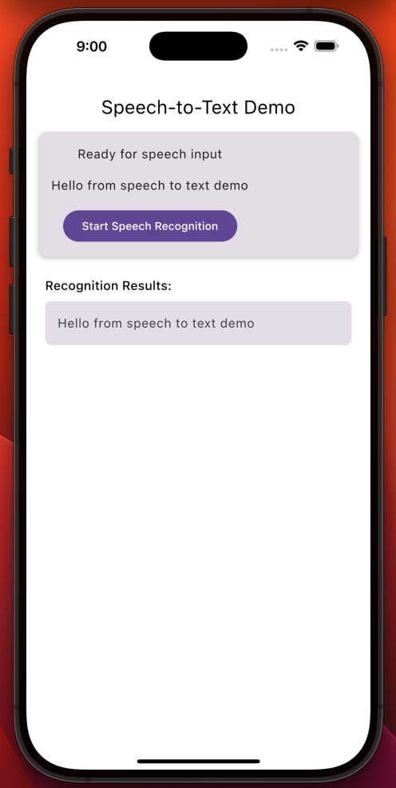
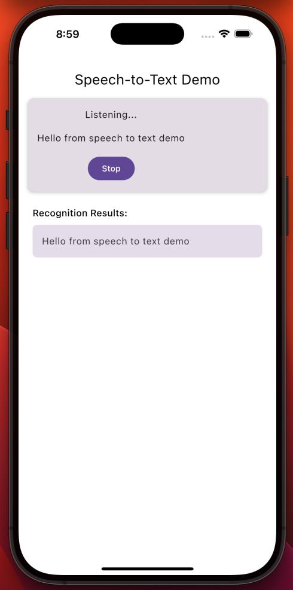
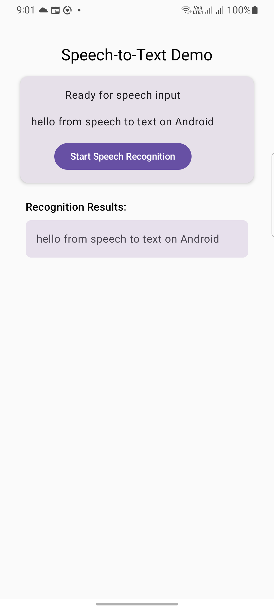

# 🎙️ SpeechToTextKit

[](LICENSE)
[](https://kotlinlang.org/docs/multiplatform.html)
[]()

SpeechToTextKit is a Kotlin Multiplatform library that provides a simple and unified API for speech-to-text functionality across multiple platforms: Android, iOS, Desktop (JVM), and Web (Wasm).

## 📋 Current Features

- **Cross-Platform Support**: Works on Android and iOS
- **Reactive API**: Receive speech recognition results as a Flow
- **Compose Integration**: Easy to use with Jetpack Compose via `rememberSpeechToText()`
- **Seamless Integration**: Integrates easily with existing KMP applications
- **State Callbacks**: Monitor recognition state changes through Flow
- **Low Friction Setup**: Minimal dependencies and configuration required
- **Error Handling**: Detailed error reporting through the result API

## 📸 Screenshots

<p float="left">
  
  
  
</p>


## 🚀 Installation

in progress...
Add the following to your `settings.gradle.kts`:

```kotlin
dependencyResolutionManagement {
    repositories {
        // ...
        maven { url = uri("https://jitpack.io") }
    }
}
```

Then add the dependency to your module's `build.gradle.kts`:

```kotlin
dependencies {
    // Core library
    implementation("com.github.eslamwael74.speechtotextkit:speechToText:1.0.0")
    
    // Optional: Compose UI components
    implementation("com.github.eslamwael74.speechtotextkit:speechToTextCompose:1.0.0")
}
```

## 📱 Usage

There are currently two ways to use this library:

### 1. In Jetpack Compose

```kotlin
import androidx.compose.material.Button
import androidx.compose.material.Text
import androidx.compose.runtime.*
import com.eslamwael74.speechtotextcompose.rememberSpeechToText

@Composable
fun SpeechRecognitionScreen() {
    var recognizedText by remember { mutableStateOf("") }
    val speechRecognizer = rememberSpeechToText()
    var isListening by remember { mutableStateOf(false) }
    
    LaunchedEffect(Unit) {
        speechRecognizer.results.collect { result ->
            recognizedText = result.text
        }
    }
    
    Column(modifier = Modifier.fillMaxSize().padding(16.dp)) {
        Text(
            text = recognizedText.ifEmpty { "Tap the button and speak" },
            modifier = Modifier.weight(1f)
        )
        
        Button(onClick = {
            if (isListening) {
                // Stop listening
                speechRecognizer.stopListening()
                isListening = false
            } else {
                // Start listening
                speechRecognizer.startListening()
                isListening = true
            }
        }) {
            Text(if (isListening) "Stop Listening" else "Start Listening")
        }
    }
}
```

### 2. In a ViewModel

```kotlin
import com.eslamwael74.speechtotext.SpeechRecognizer
import com.eslamwael74.speechtotext.SpeechRecognizerFactory
import kotlinx.coroutines.flow.launchIn
import kotlinx.coroutines.flow.onEach

// Using dependency injection
class YourViewModel(
    private val speechRecognizer: SpeechRecognizer
) {
    init {
        // Listen for speech recognition results
        speechRecognizer.results.onEach { result ->
            // Handle result
            println("Recognized text: ${result.text}")
        }.launchIn(viewModelScope)
        
        // Monitor state changes
        speechRecognizer.state.onEach { state ->
            // Handle state changes
            println("Recognition state: $state")
        }.launchIn(viewModelScope)
    }
    
    fun startListening() {
        viewModelScope.launch {
            speechRecognizer.startListening()
        }
    }
    
    fun stopListening() {
        viewModelScope.launch {
            speechRecognizer.stopListening()
        }
    }
    
    fun cleanup() {
        speechRecognizer.destroy()
    }
}

// Example of factory/provider to create the SpeechRecognizer
class SpeechRecognizerProvider(
    private val applicationContext: Context
) {
    fun provideSpeechRecognizer(): SpeechRecognizer {
        return SpeechRecognizerFactory(applicationContext).createSpeechRecognizer()
    }
}

// Usage with Manual DI
class YourActivity : AppCompatActivity() {
    private val speechRecognizerProvider by lazy {
        SpeechRecognizerProvider(applicationContext)
    }
    
    private val viewModel by viewModels {
        viewModelFactory { 
            YourViewModel(speechRecognizerProvider.provideSpeechRecognizer())
        }
    }
}

// Or with Hilt/Dagger
@Module
@InstallIn(SingletonComponent::class)
object SpeechModule {
    @Provides
    @Singleton
    fun provideSpeechRecognizer(@ApplicationContext context: Context): SpeechRecognizer {
        return SpeechRecognizerFactory(context).createSpeechRecognizer()
    }
}
```

## 📝 Platform-Specific Setup

### Android

Add the following permission to your `AndroidManifest.xml`:

```xml
<uses-permission android:name="android.permission.RECORD_AUDIO" />
```

You'll also need to request this permission at runtime.

### iOS

Add the following to your `Info.plist`:

```xml
<key>NSMicrophoneUsageDescription</key>
<string>This app needs access to your microphone for speech recognition</string>
<key>NSSpeechRecognitionUsageDescription</key>
<string>This app uses speech recognition to convert your speech to text</string>
```

## 🚧 Upcoming Features

The following features are planned but not yet implemented:

- Compose UI component with built-in microphone button
- Customizable recognition parameters (language, timeout, etc.)
- Offline recognition support where available
- Improved error handling and recovery
- Text-to-Speech capabilities
- Support requesting permissions for Android at runtime
- TextField Composable with integrated microphone button
- Support for more languages and dialects
- Support WebAssembly (Wasm) for web applications
- Support for desktop platforms (JVM)
- Support for macOS

## 🧪 Example App

Check out the included example app in the `/example` directory for a complete implementation of SpeechToTextKit.

## 🙌 Contributing

Contributions are welcome! Please feel free to submit a Pull Request.

1. Fork the Project
2. Create your Feature Branch (`git checkout -b feature/amazing-feature`)
3. Commit your Changes (`git commit -m 'Add some amazing feature'`)
4. Push to the Branch (`git push origin feature/amazing-feature`)
5. Open a Pull Request

## 📄 License

Distributed under the Apache 2.0 License. See `LICENSE` for more information.

## 📞 Contact

Eslam Wael - [@eslamwael74](https://github.com/eslamwael74)

Project Link: [https://github.com/eslamwael74/speechtotextkit](https://github.com/eslamwael74/speechtotextkit)

